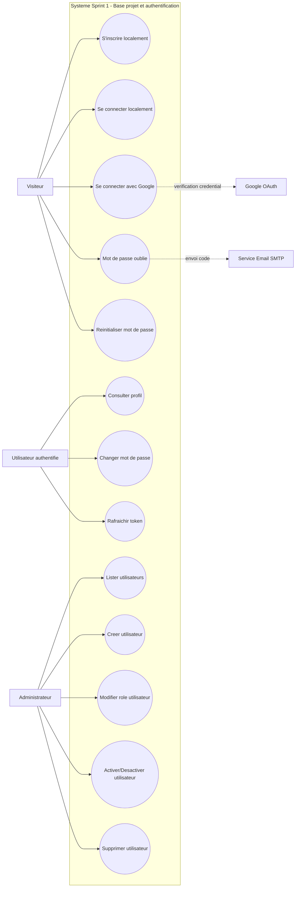
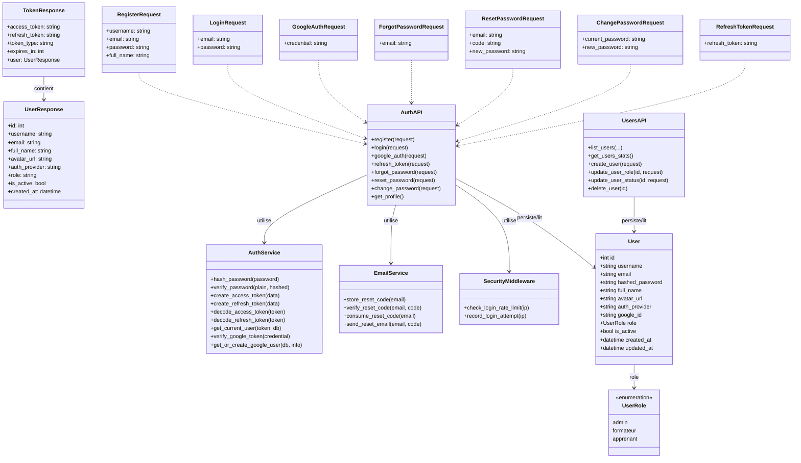
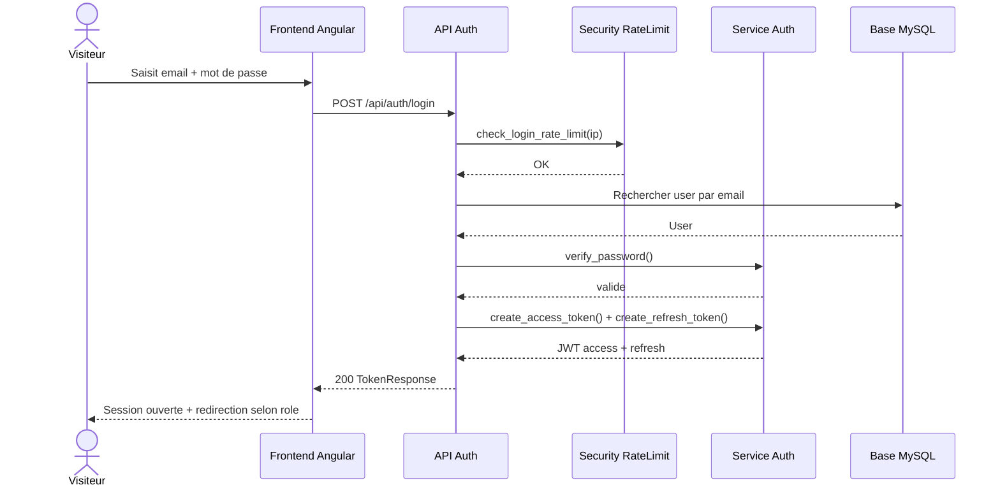
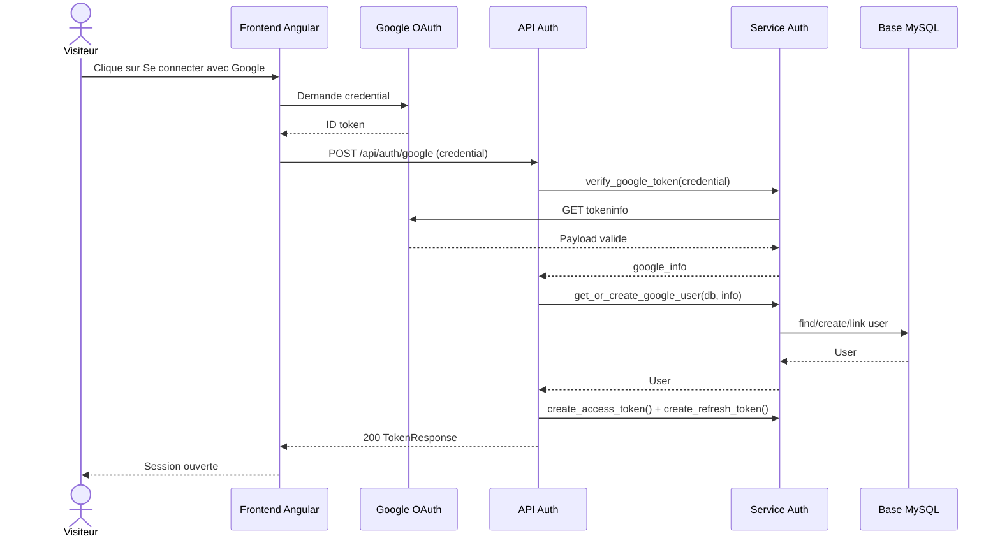
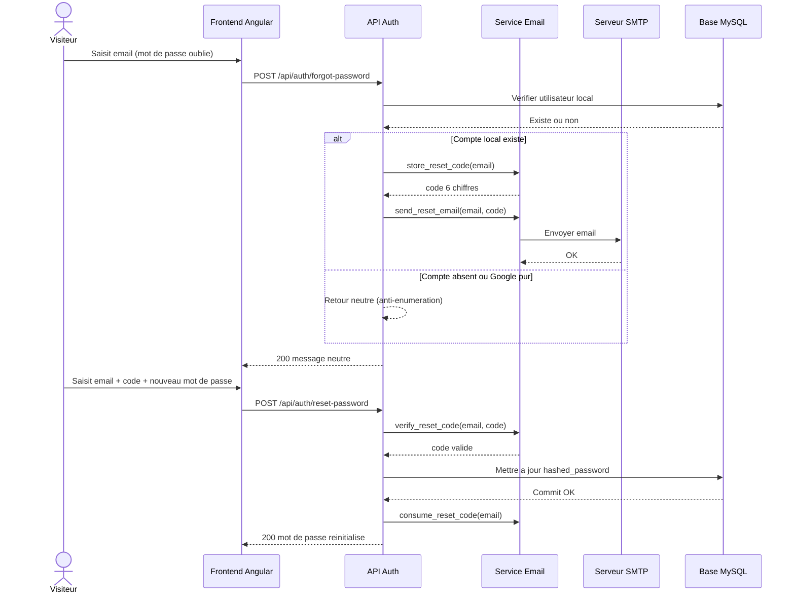
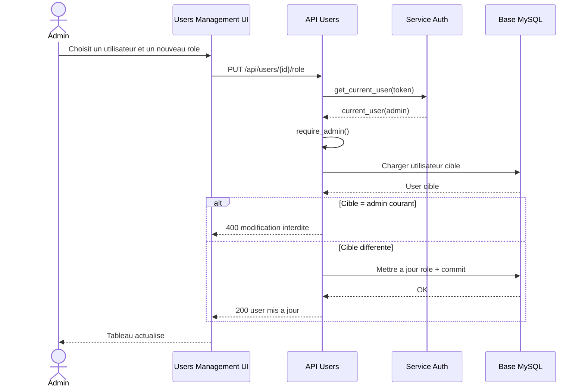

# Chapitre 3 - Sprint 1: Base projet et authentification

## 3.1 Introduction du Sprint 1

Le Sprint 1 a pour objectif de poser les fondations techniques et fonctionnelles de la plateforme. Il couvre:

1. La mise en place de la base projet (backend FastAPI, frontend Angular, structure modulaire).
2. Le socle de securite et d'authentification (JWT, OAuth Google, protection des acces).
3. Les fonctions essentielles de gestion des comptes et des utilisateurs.

Ce sprint constitue la base sur laquelle les sprints suivants (cours, QCM, chatbot, statistiques) peuvent s'appuyer.

## 3.2 Objectif et perimetre

### 3.2.1 Objectif general

Fournir un systeme d'authentification fiable, securise et extensible, avec gestion des roles (admin, formateur, apprenant).

### 3.2.2 Perimetre fonctionnel retenu

Les cas d'utilisation raffines pour ce sprint sont:

1. Authentification:
   - Inscription locale
   - Connexion locale
   - Connexion Google
   - Mot de passe oublie
   - Reinitialisation du mot de passe
   - Rafraichissement du token
2. Gestion du profil:
   - Consultation du profil
   - Changement du mot de passe
3. Gestion des utilisateurs (admin):
   - Lister les utilisateurs
   - Creer un utilisateur
   - Modifier le role
   - Activer/desactiver un compte
   - Supprimer un utilisateur

## 3.3 Acteurs du Sprint 1

1. Visiteur: utilisateur non authentifie qui accede aux pages publiques et aux ecrans d'authentification.
2. Utilisateur authentifie: apprenant, formateur ou administrateur connecte.
3. Administrateur: utilisateur authentifie avec privileges etendus pour gerer les comptes.
4. Google OAuth: fournisseur externe d'identite.
5. Service Email SMTP: service externe pour l'envoi du code de reinitialisation.

## 3.4 Cas d'utilisation raffines (Sprint 1)

## 3.4.1 UC1 - S'inscrire (local)

1. Acteur principal: Visiteur.
2. Preconditions: email et username non utilises.
3. Scenario nominal:
   - Le visiteur soumet username, email, mot de passe, nom complet.
   - Le systeme valide la complexite du mot de passe et l'unicite des donnees.
   - Le compte est cree en base avec mot de passe hache.
   - Le systeme retourne access token, refresh token et profil.
4. Postconditions: compte actif cree et session ouverte.
5. Exceptions: email/username deja existant, mot de passe non conforme.

## 3.4.2 UC2 - Se connecter (local)

1. Acteur principal: Visiteur.
2. Preconditions: compte local existant et actif.
3. Scenario nominal:
   - L'utilisateur saisit email + mot de passe.
   - Le systeme verifie rate limit, credentials et etat du compte.
   - Le systeme genere et retourne les tokens JWT et le profil.
4. Postconditions: session authentifiee ouverte.
5. Exceptions: compte Google sans mot de passe, identifiants invalides, compte desactive, blocage rate limit.

## 3.4.3 UC3 - Se connecter avec Google

1. Acteur principal: Visiteur.
2. Acteur secondaire: Google OAuth.
3. Preconditions: credential Google valide.
4. Scenario nominal:
   - Le visiteur choisit l'authentification Google.
   - Le systeme verifie le token Google (audience + email verifie).
   - Le systeme retrouve ou cree le compte local associe.
   - Le systeme retourne les tokens JWT de la plateforme.
5. Postconditions: session ouverte avec compte lie a Google.
6. Exceptions: token invalide, audience non autorisee, compte desactive.

## 3.4.4 UC4 - Mot de passe oublie

1. Acteur principal: Visiteur.
2. Acteur secondaire: Service Email SMTP.
3. Preconditions: adresse email saisie.
4. Scenario nominal:
   - L'utilisateur saisit son email.
   - Le systeme genere un code a 6 chiffres (si compte local existant).
   - Le code est envoye par email.
   - Le systeme renvoie un message neutre pour eviter l'enumeration des comptes.
5. Postconditions: code temporaire stocke en memoire avec expiration.
6. Exceptions: email non associe, compte Google pur, erreur SMTP (message neutre conserve cote API).

## 3.4.5 UC5 - Reinitialiser le mot de passe

1. Acteur principal: Visiteur.
2. Preconditions: code valide et non expire.
3. Scenario nominal:
   - L'utilisateur soumet email, code et nouveau mot de passe.
   - Le systeme verifie le code puis met a jour le mot de passe hache.
   - Le systeme invalide le code utilise.
4. Postconditions: mot de passe mis a jour.
5. Exceptions: code invalide/expire, utilisateur introuvable.

## 3.4.6 UC6 - Consulter son profil

1. Acteur principal: Utilisateur authentifie.
2. Preconditions: token JWT valide.
3. Scenario nominal:
   - L'utilisateur appelle l'endpoint profil.
   - Le systeme extrait l'identite depuis le token et retourne les informations du compte.
4. Postconditions: profil affiche dans l'interface.
5. Exceptions: token invalide/expire, compte desactive.

## 3.4.7 UC7 - Changer son mot de passe

1. Acteur principal: Utilisateur authentifie.
2. Preconditions: compte local et mot de passe actuel correct.
3. Scenario nominal:
   - L'utilisateur saisit mot de passe actuel + nouveau mot de passe.
   - Le systeme verifie l'ancien mot de passe, les regles de complexite et la difference avec l'ancien.
   - Le systeme enregistre le nouveau hash.
4. Postconditions: nouveau mot de passe actif.
5. Exceptions: compte Google pur, ancien mot de passe incorrect, nouveau mot de passe invalide.

## 3.4.8 UC8 - Lister les utilisateurs (admin)

1. Acteur principal: Administrateur.
2. Preconditions: utilisateur connecte avec role admin.
3. Scenario nominal:
   - L'admin consulte la liste paginee des utilisateurs.
   - L'admin applique des filtres (recherche, role, statut).
   - Le systeme retourne les donnees et la pagination.
4. Postconditions: vue de supervision actualisee.
5. Exceptions: acces refuse si role non admin.

## 3.4.9 UC9 - Creer un utilisateur (admin)

1. Acteur principal: Administrateur.
2. Preconditions: role admin.
3. Scenario nominal:
   - L'admin saisit username, email, mot de passe, role.
   - Le systeme verifie unicite puis cree le compte local.
4. Postconditions: nouvel utilisateur present dans le systeme.
5. Exceptions: email/username existant, role invalide.

## 3.4.10 UC10 - Modifier role/statut/suppression (admin)

1. Acteur principal: Administrateur.
2. Preconditions: role admin et utilisateur cible existant.
3. Scenario nominal:
   - L'admin modifie le role ou active/desactive un compte, ou supprime un compte.
   - Le systeme applique la regle metier (interdiction d'auto-modification critique).
4. Postconditions: compte cible mis a jour.
5. Exceptions: tentative sur son propre compte (role/statut/suppression), utilisateur non trouve.

## 3.5 Diagramme de cas d'utilisation - Sprint 1

## 3.6 Diagramme de classes - Sprint 1

## 3.7 Diagrammes de sequence - Sprint 1

## 3.7.1 Sequence - Connexion locale

## 3.7.2 Sequence - Connexion Google OAuth

## 3.7.3 Sequence - Mot de passe oublie + reinitialisation

## 3.7.4 Sequence - Administration des utilisateurs (modifier role)

## 3.8 Synthese du Sprint 1

Le Sprint 1 livre une base applicative exploitable, securisee et evolutive:

1. Authentification complete: local, Google, reset mot de passe, refresh token.
2. Controle d'acces solide: JWT, role-based access, guard frontend et verification backend.
3. Administration des comptes: supervision et actions CRUD admin.
4. Durcissement securite: rate limiting, audit logs, headers HTTP de securite.

Ces acquis constituent un socle technique robuste pour les sprints fonctionnels suivants (contenus, QCM, chatbot intelligent, statistiques avancees).
