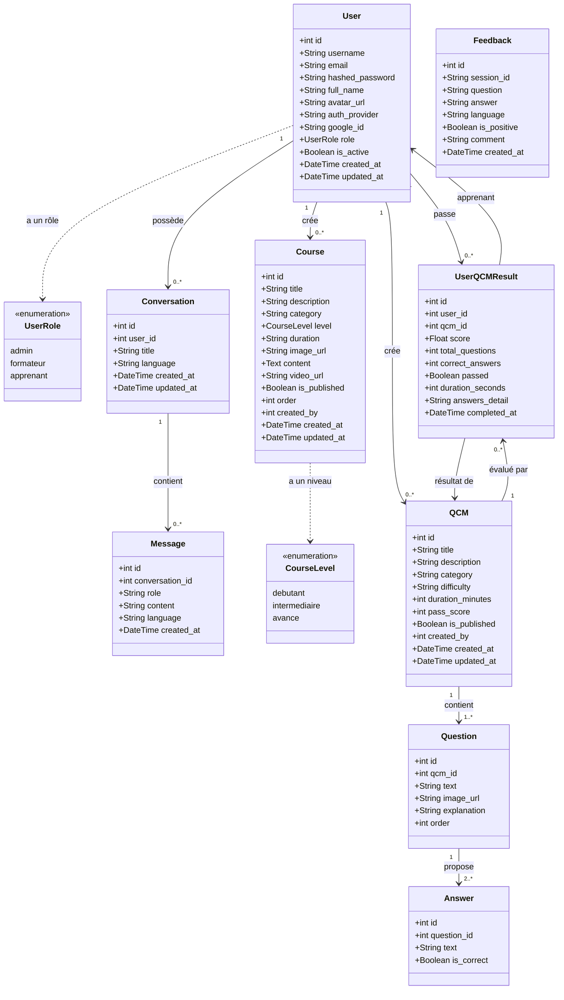
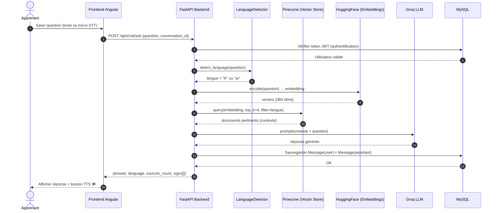
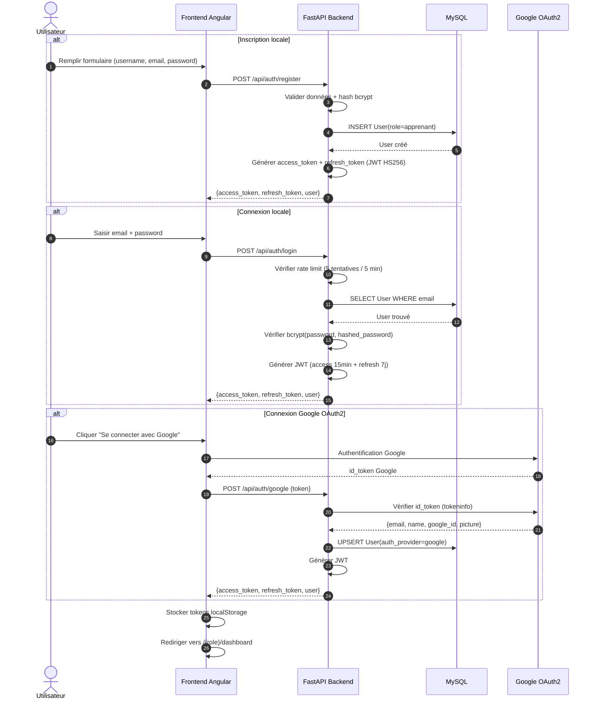
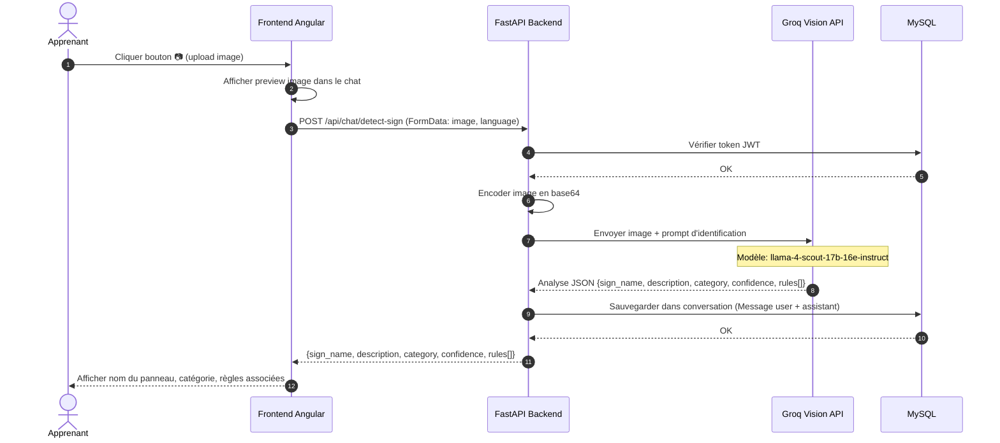
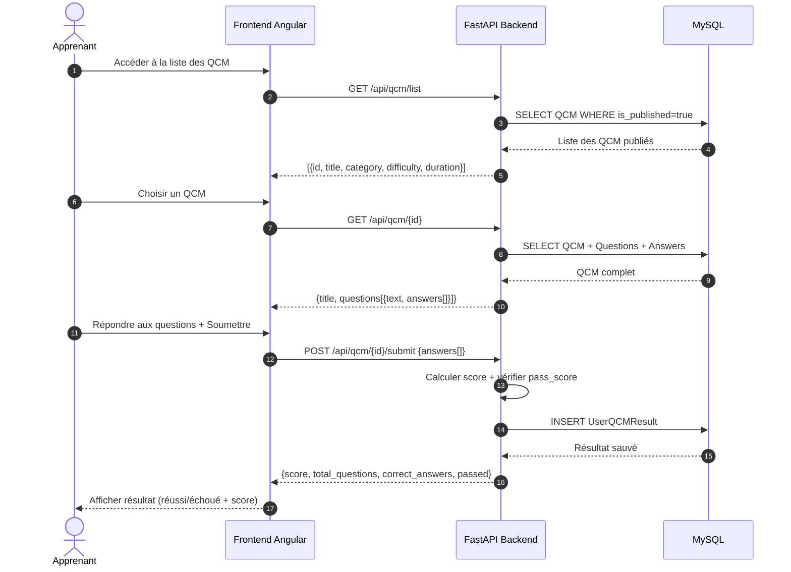

# Diagrammes UML — Plateforme Sécurité Routière

> Coller le code Mermaid dans [mermaid.live](https://mermaid.live) pour exporter en PNG/SVG.

---

## 1. Diagramme de Cas d'Utilisation (Use Case)

```mermaid
graph TB
    subgraph Visiteur["🔓 Visiteur (non authentifié)"]
        V_REG["S'inscrire (Local)"]
        V_LOGIN["Se connecter (JWT)"]
        V_GOOGLE["Se connecter via Google OAuth2"]
        V_FORGOT["Mot de passe oublié"]
        V_RESET["Réinitialiser mot de passe"]
        V_COURS_PUB["Consulter cours publiés"]
    end

    subgraph Apprenant["🎓 Apprenant"]
        A_DASH["Consulter dashboard"]
        A_COURS["Consulter les cours"]
        A_QCM["Passer un QCM"]
        A_RESULT["Voir résultats QCM"]
        A_CHAT["Poser une question au Chatbot (RAG)"]
        A_IMG["Détecter un panneau par image (Vision IA)"]
        A_STT["Utiliser la reconnaissance vocale (STT)"]
        A_TTS["Écouter les réponses du bot (TTS)"]
        A_HIST["Gérer historique conversations"]
        A_FEED["Donner un feedback 👍👎"]
        A_PROFIL["Modifier profil / mot de passe"]
        A_STATS["Voir statistiques personnelles"]
    end

    subgraph Formateur["👨‍🏫 Formateur"]
        F_DASH["Consulter dashboard"]
        F_COURS_C["Créer un cours"]
        F_COURS_M["Modifier / Supprimer un cours"]
        F_COURS_P["Publier / Dépublier un cours"]
        F_STATS["Voir statistiques (cours)"]
        F_PROFIL["Modifier profil"]
    end

    subgraph Admin["🛡️ Administrateur"]
        AD_DASH["Consulter dashboard"]
        AD_USERS["Gérer les utilisateurs (CRUD)"]
        AD_ROLE["Modifier rôle utilisateur"]
        AD_STATUS["Activer / Désactiver un compte"]
        AD_QCM_C["Créer un QCM"]
        AD_QCM_M["Modifier / Supprimer un QCM"]
        AD_QCM_P["Publier un QCM"]
        AD_COURS["Gérer tous les cours"]
        AD_STATS["Voir statistiques globales"]
        AD_FEED["Consulter feedback chatbot"]
        AD_INGEST["Ingérer des documents (RAG)"]
    end

    subgraph Systeme["⚙️ Système"]
        S_RAG["Pipeline RAG (Pinecone + Groq LLM)"]
        S_VISION["Détection panneau (Groq Vision)"]
        S_JWT["Authentification JWT"]
        S_LANG["Détection langue (FR/AR)"]
        S_EMBED["Embeddings HuggingFace"]
    end

    A_CHAT --> S_RAG
    A_CHAT --> S_LANG
    A_IMG --> S_VISION
    S_RAG --> S_EMBED
    V_LOGIN --> S_JWT
    V_GOOGLE --> S_JWT
    AD_INGEST --> S_EMBED
```

---

## 2. Diagramme de Classes

---

## 3. Diagramme de Séquence — Chatbot RAG (Question/Réponse)

---

## 4. Diagramme de Séquence — Authentification (Local + Google OAuth2)

---

## 5. Diagramme de Séquence — Détection de Panneau par Image (Vision IA)

---

## 6. Diagramme de Séquence — Passer un QCM

